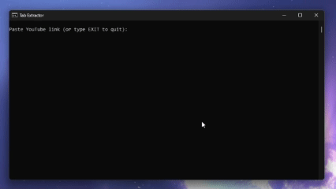

# TabStich - Guitar Tab Extractor



A powerful tool for extracting guitar tablature from videos with automatic deduplication and stitching capabilities.

## Features

- Extract tabs from YouTube videos or local files
- Intelligent deduplication using perceptual hashing
- Vertical stitching of tab snippets into one image
- Customizable frame sampling and comparison settings

## Installation

### Prerequisites

- Python 3.10
- pip package manager

### Manual Installation Steps

```bash
# Clone the repository
git clone https://github.com/shreywy/guitar-tab-extractor.git
cd guitar-tab-extractor

# Create virtual environment (recommended)
python -m venv .venv
.venv\Scripts\activate  # Windows

# Install dependencies
pip install -r requirements.txt
```

## Usage

### Command Line

Basic usage:

```bash
python tab_extractor.py --url "https://youtube.com/watch?v=..." --out "my_tabs.png"
```

Advanced example:

```bash
python tab_extractor.py --video "song.mp4" --sample-fps 4.0 --hash-thresh 8 --crop-bottom-frac 0.4 --out "custom_tabs.png"
```

### Windows Batch Script (Easy Use)

Double-click `run_tabs.bat`, paste a YouTube link, and it will process it automatically. Type `exit` to close the script.

## Technical Implementation

The Guitar Tab Extractor uses a multi-stage processing pipeline:

1. **Frame Sampling**

   - Videos are decoded using OpenCV's VideoCapture
   - Frames are sampled at a configurable rate (1-10 FPS)
   - Only the bottom portion (configurable) is extracted for tab detection (default is bottom 33%, usually where tab videos overlay)

2. **Perceptual Deduplication**

   - Each frame is converted to grayscale and normalized
   - The image is split into 5 horizontal segments
   - Each segment is hashed using imagehash's pHash algorithm
   - Segments are compared against previous frames using Hamming distance
   - Frames with >3 similar segments are discarded

3. **Output Generation**

   - Selected frames are resized to uniform width
   - Vertical stacking with padding between segments
   - Automatic output naming with conflict resolution (-1, -2 suffixes)
   - Final image saved as lossless PNG

Key Technologies:

- OpenCV for video processing and image manipulation
- imagehash for perceptual comparison
- yt-dlp for YouTube video downloading

## Configuration Options

| Parameter      | CLI Flag             | Default | Description                    |
| -------------- | -------------------- | ------- | ------------------------------ |
| Sample Rate    | `--sample-fps`       | 3.0     | Frames to process per second   |
| Hash Threshold | `--hash-thresh`      | 10      | Similarity sensitivity (1-20)  |
| Bottom Crop    | `--crop-bottom-frac` | 0.33    | Portion of frame to analyze    |
| Max Segments   | `--max-segments`     | 0       | Limit number of tabs extracted |

## Troubleshooting

**Problem**: Missing dependencies

```bash
pip install --upgrade pip
pip install -r requirements.txt
```

**Problem**: Video processing errors

- Try reducing sample FPS
- Check video file integrity

**Notes**:
I dont plan to work on this, just wanted a way to get tabs off Youtube videos for my use and that just fulfils the purpose of the tool.